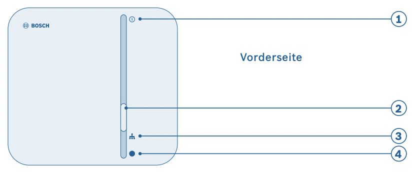

<p>


</p>

# Homebridge Bosch Alerting system

This plugin exposes the Bosch smarthome alerting (intrusion) system to Homekit.
It is based on the [bosch-smart-home-bridge library](https://github.com/holomekc/bosch-smart-home-bridge) and
the [Bosch Smarthome local API](https://github.com/BoschSmartHome/bosch-shc-api-docs).

## Alarm profiles

Homekit supports 3 alarm profiles, which are mapped to the following Bosch alarm profiles:

- `away` is mapped to "Full protection"
- `present` is mapped to "Partial protection"
- `night` is mapped to "Full protection"

Currently you cannot map other profiles or reconfigure the existing mapping.

## Triggering alarms

Triggering alarms is currently not supported, but an active alarm will be displayed.

## Certificates

The Smarthome API uses [mutual TLS](https://www.cloudflare.com/de-de/learning/access-management/what-is-mutual-tls/) to protect itself from unwanted access.  
This requires you to authenticate the plugin before it can be used.  
To do so, several steps need to be executed.

It is recommended to generate and register a certificate yourself, as these credentials will stay intact even when the homebridge state is lost and you have more control over them (e.g. you can define the lifetime). It is also much clearer on when to use the "pair" button on your controller.

### Let homebridge generate certificates

This option generates a certificate through the homebridge plugin.  
The certificate will stay valid for 10 years.
To enable this you must provide your Bosch smarthome controller system password.

After configuring the plugin, and ideally *_before you restart homebridge_* you have to press the pairing button (2) on your Bosch smarthome controller. 



If the pairing process succeeded, the plugin should show in your bosch smarthome app.
If you have to re-pair, you need to remove the plugin from the bosch smarthome app first.

### Generate certificates yourself

These steps have been derived from the [Bosch API docs](https://github.com/BoschSmartHome/bosch-shc-api-docs/tree/master/postman).


1. You need to create an RSA key pair, that will identifiy your client. The following will create a certificate that is valid for 10 years (`-days 3650`).

   ```bash
   openssl req -x509 -nodes -days 3650 -newkey rsa:2048 -keyout client-key.pem -out client-cert.pem
   ```

2. Find out your Smarthome controller IP. Test it with the following command. The `CONTROLLER_IP` variable will be used in later steps.
   
   ```bash
   CONTROLLER_IP=192.168.0.10
   ```
 
   ```bash
   curl -sk "https://${CONTROLLER_IP}:8446/smarthome/public/information"
   ```

3. Generate a client request file named `request.json` using your editor of choice.
   Make sure the certificate string has the form `-----BEGIN CERTIFICATE-----\r....\r-----END CERTIFICATE-----`.
   Especially the two `\r` are important.

   ```json
   {
       "@type": "client",
       "id": "oss_homebridge",
       "name": "OSS Homebridge plugin",
       "primaryRole": "ROLE_RESTRICTED_CLIENT",
       "certificate": "insert the content of client-cert.pem here"
   }
   ```
4. Press the paring button on your Smarthome controller (see [previous section](#let-homebridge-generate-certificates))
5. Pair with the controller. Please note that the port used in step 2 is different for this call.

   ```bash
   curl -sk -X POST \
     -H "Content-Type: application/json" \
     -H "Expect:" \
     -H "Systempassword: $(echo -n 'insert controller password here' | base64)" \
     -d @request.json \
     "https://${CONTROLLER_IP}:8443/smarthome/clients"
   ```

   This call will register the client certificate with the server.
   It should now show up in your Bosch smarthome app.
   If you receive an HTTP 401 error, the password is likely wrong.

Store the client key and signed certificate in a safe location.
You will need to pass the certificate and client key to the plugin.

### Setup certificates

To use the plugin, you must pass the client certificate and key registered in the step above.  
As Homebridge does not support multi-line text fields, but linefeeds are required here, you need to pass in the two files as base64 encoded.

```bash
base64 -i client-cert.pem # your encoded certificate
base64 -i client-key.pem  # your encoded client key
```

## Maintenance

This plugin uses [volta](https://volta.sh) to manage nodejs tools dependencies.

The repository is based on the [homebridge plugin template](https://github.com/homebridge/homebridge-plugin-template/tree/latest). Take more detail build instructions from there.

Here are some useful commands

### Build and test

```
# Run once for installing latest dev dependencies
npm install

# Run once per session for testing
homebridge -D &

# Build
npm run build

# Update changes for local homebridge to use
npm link
```

### Publish

```
npm publish --dry-run
npm publish --tag '1.0.3'
```

### Update package-lock.json

```
npm i --package-lock-only
```